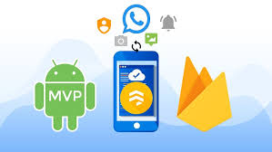

# Experto en Firebase para Android + MVP Curso Completo +30hrs

## Descripcion 

Curso tomado en la platafoma Udemy

https://www.udemy.com/course/especialidad-en-firebase-para-android-con-mvp-profesional/

Apps Android nivel profesional con Firebase, Firestore, Push Notifications, Auth, Material Design, Patrones Diseño, PHP.

El curso es impartido por Alain Nicolás Tello

## Galeria

## Lo que se aprendera 

- Desarrollar una app profesional tipo chat y red social con múltiples servicios de Firebase.
- Enviar notificaciones push a un dispositivo android o a un grupo(FCM).
- Subir y bajar fotografías a la nube(Firebase Storage) desde la galería, cámara o google fotos.
- Iniciar sesión con Redes Sociales(Facebook, Google o email/contraseña).
- Crear aplicaciones con bases de datos en tiempo real(Firebase Realtime Database y Cloud Firestore).
- Implementar Firestore en un proyecto y ver las diferencias con Realtime Database.
- Conocer a profundidad que es y como usar Firebase correctamente en Android.
- Programar profesionalmente con patrones de diseño para android con MVP, Singleton y SRP.
- Análisis de nuestra app, comportamiento de usuarios, errores, funciones más utilizadas y más con Google Analitycs for Firebase.
- Modificar el comportamiento y/o aspecto de forma remota sin enviar una actualización a la Goolge Play Store.
- Utilizar librerías en Android para el tratamiento de imágenes, comunicación entre clases, vinculación de vistas y más.
- Tener un entorno de desarrollo completo para android, y así crear y probar las aplicaciones.
- Usar PHP en un servidor externo para el envío de notificaciones entre dispositivos.
